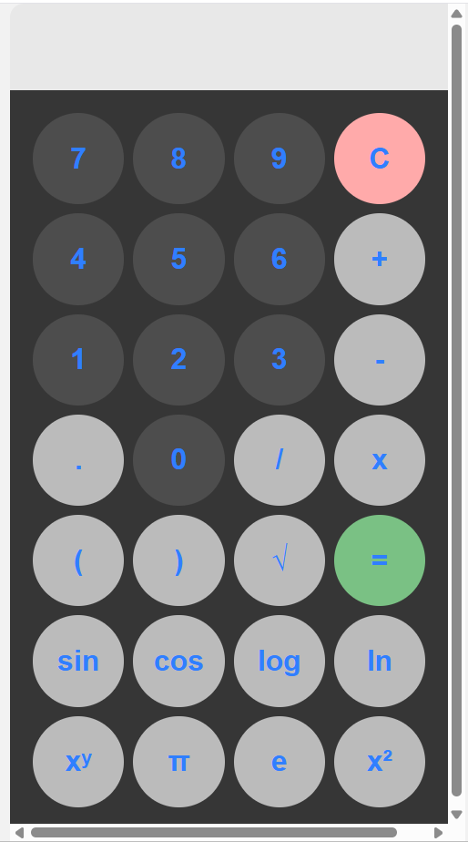

# JS-CSS-HTML-calculator
A simple calculator made using JS/CSS/HTML that uses eval()

## Table of Contents

* [🔧 Installation](#-installation)
* [💡 Usage](#-usage)
* [✨ Features](#-features)
* [🛠️ Tech Stack](#️-tech-stack)
* [📸 Screenshots](#-screenshots)
* [🤝 Contributing](#-contributing)
* [✉️ Contact](#️-contact)
* [📄 License](#-license)

---

## 🔧 Installation

1. **Clone the repository**

   ```bash
   git clone https://github.com/DaemoniaX/JS-CSS-HTML-calculator.git
   ```
2. **Install dependencies**

   none
   
3. **Serve locally**

   Click to open the HTML file.

## 💡 Usage

* Calculate simple operations

---

## ✨ Features

* Responsive UI with Angular Material
* Reactive forms and state management via RxJS
* Product catalog pagination and filtering
* Shopping cart persistent across sessions
* Integration with RESTful API for CRUD operations

---

## 🛠️ Tech Stack

* **Language**: JavaScript v22.15.1, HTML, CSS
* **Styling**: css

---

## 📸 Screenshots

---


---

## 🤝 Contributing

Contributions, issues and feature requests are welcome! Please feel free to:

* Fork the repository
* Create an issue for bugs or enhancements
* Submit a pull request

---

## ✉️ Contact

**Name**: Antonin Marolleau  
**School**: ESIEE Paris – Integrated Engineering Program second year  
**Email**: [antonin.marolleau@edu.esiee.fr](mailto:antonin.marolleau@edu.esiee.fr)  
**LinkedIn**: [https://www.linkedin.com/in/antonin-marolleau-7b5497339](https://www.linkedin.com/in/antonin-marolleau-7b5497339)  

---

## 📄 License

This project is licensed under the CC0 License.

